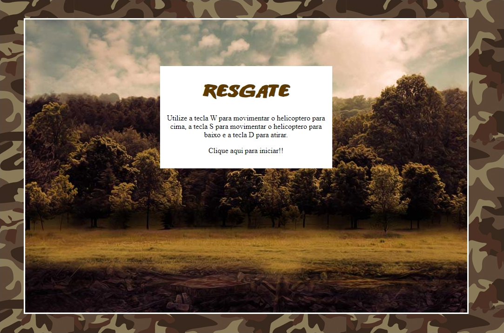
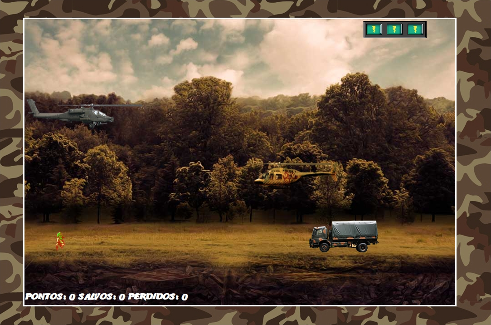

<h1 align="center">
Primeiro Jogo de Nava resgate
</h1>

O projeto consiste em um pequeno jogo de Naves onde você tem um placar para marca a pontuação de aliados resgatados e inimigos eliminado.
Foi trabalhado diversos conceitos de animação com JS e tambem muita logica para desenvolver os efeitos de coalisão.
 

  
   

## Resultado da aplicação

## Tecnologias Utilizadas

- [X] Javascript
- [X] Jquery
- [X] HTML5
- [X] CSS3

## Deploy
O deploy do jogo foi feito atravez da plataforma Vercel  
Link do Deploy: https://game-orpin.vercel.app/
